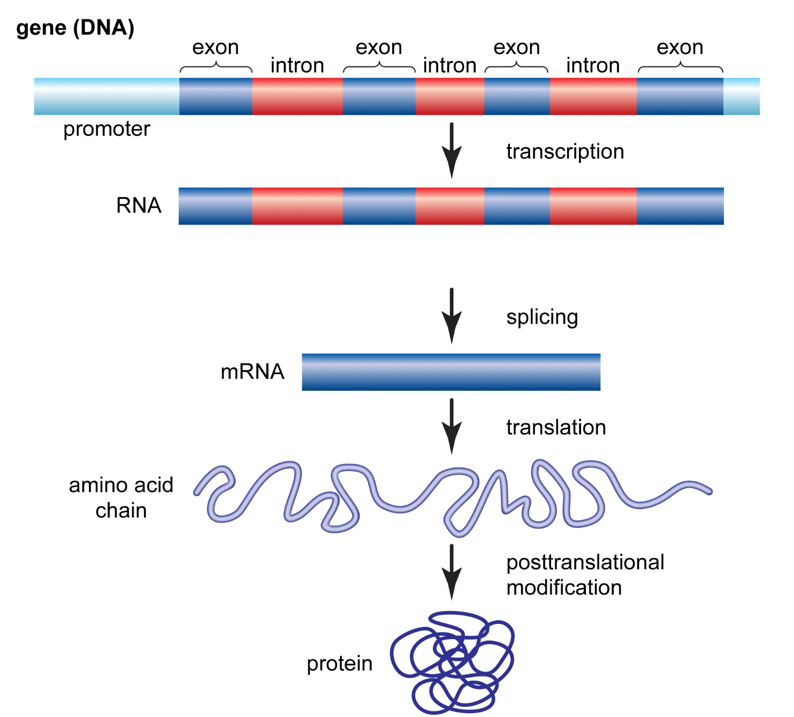

# Protein Biosynthesis
Protein biosynthesis is a very complex process. We will not go into the details here, but rather provide a high-level overview. If you are interested in learning more, there are many excellent resources available online and in the literature.

Protein biosynthesis is the central framework for placing the individual omics fields. It consists of transcription + (processing) + translation. In essence, the DNA information inside the nucleus is copied to RNA, carried out into the cytoplasm (the cell interior outside the nucleus) and translated into proteins there.

source: https://www.britannica.com/science/gene

## Basic Definitions

### DNA

Molecule that stores genetic information in the nucleus of a cell. A double helix of two complementary strands made of nucleotides. Each nucleotide has one of four bases: A, C, G, T. Bases are paired: A–T and G–C. Each strand is a template for the other. Strands have a direction (5' → 3'). Sequences are written in this direction.

### RNA
Single-stranded copy of a DNA segment. It has a uracil (U) instead of thymine (T).

### Gene

A gene is a section of DNA that is transcribed into RNA, which is usually translated into a protein. It consists of:
- Exons: The parts that remain in the mature mRNA after splicing. They contain the coding sequence (the actual protein sequence) and untranslated regions (5' and 3' UTR). In the genome, the coding sequence is split across several exons, with introns in between.
- Introns: Spliced out before translation, but can carry regulatory elements (how much of what DNA parts to transcribe) and enable alternative splicing (how to combine exons to form different proteins from the same gene).

### Protein

A chain of amino acids that folds into a specific 3D structure. Each amino acid is encoded by three nucleotides (a codon). The structure determines its function. 
Proteins do most of the work in the cell. They act as enzymes, structural components, receptors, transporters and signals.

## Biosynthesis Steps

### Transcription

DNA in the nucleus is transcribed into RNA.

- RNA polymerase does most of the work: it unwinds the DNA double strand, moves along the template (antisense) strand, and builds a complementary pre-mRNA from free nucleotides.
- Each gene starts at a promoter and ends at a terminator.
- Once the RNA is complete, polymerase and RNA detach and the DNA rewinds.

### Processing (eukaryotes only)

Turns pre-mRNA into mature mRNA.

- Capping: A modified guanine (5' cap) is added, protecting the mRNA from degradation and preparing it for translation.
- Polyadenylation: A tail of adenines (poly-A tail) is added; also protects from degradation.
- Splicing: Introns are cut out (they are part of DNA and pre-mRNA, but not of the protein).

### Translation

mRNA is translated into a protein (a long chain of amino acids).

- The amino-acid information originates in the DNA and is carried over into the mRNA.
- 3 bases of mRNA (a codon) → 1 amino acid.
- The ribosome pairs each codon with a tRNA carrying the complementary anticodon and the matching amino acid and links the amino acids together.

## Transcription in Detail

### Chromatin

DNA is very long but must fit into the small nucleus, so it is tightly wrapped around proteins called histones. Chromatin can be open (loosely wrapped around the histones) or closed (densely packed). For transcription, the DNA must be open.

Every cell has the same DNA, but different regions are open: a liver cell opens liver genes, a neuron opens neuronal genes. Open chromatin is thus a kind of fingerprint of the cell type. 

### Transcriptional Regulation

Controls whether, when, where and how strongly a gene is transcribed into RNA.
- Regulatory elements: DNA sequences that control transcription: promoters, enhancers, silencers, insulators.
- Transcription factors (TFs): Proteins that bind to the DNA. They activate or block RNA polymerase:
  - Activators recruit polymerase and helper proteins → the gene is transcribed.
  - Repressors block this → the gene stays off.
- Chromatin / epigenetics:
  - Accessibility: Open chromatin (measurable with ATAC-seq) is a prerequisite for TF binding.
  - Histone modifications: Chemical marks on the histones determine which parts are open for transcription.
  - DNA methylation: Methylated CpGs in promoters usually mean silencing, because they block binding of some TFs.

### Transcripts

A transcript is any RNA molecule transcribed from DNA. mRNA is just one type; others include rRNA (part of the ribosome), tRNA (adapter between RNA and protein "language"), lncRNA and miRNA (both regulatory).
In bioinformatics, a transcript often means a specific isoform, i.e. a particular exon combination of a gene. In Ensembl, for example, one gene (ENSG…) has several transcripts (ENST…).

### Transposable Elements

DNA segments that can copy themselves or move to another location in the genome. They are usually silenced by methylation. When active, they can disrupt genes or act as new regulatory elements. They are difficult for short-read alignment because they are repetitive.

### Alternative Splicing

A regulated process that produces several proteins from one gene.
A gene consists of exons and introns; splicing removes the introns. Exons can be combined differently (e.g. an exon is skipped), yielding several mRNA variants and thus different proteins.
